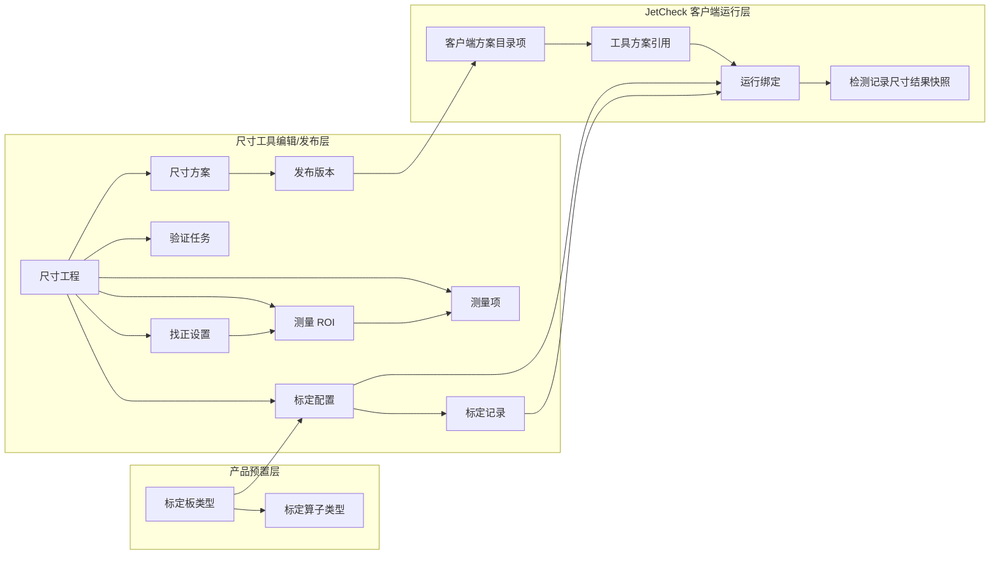

# JetCheck 1.4 对象模型草案 v0.1

本文档用于定义 1.4 尺寸检测方向的核心对象、对象边界和对象关系。

目标不是一次性定完所有字段，而是先把下面 3 件事说清楚：

1. 哪些对象属于尺寸工具编辑态
2. 哪些对象属于发布态产物
3. JetCheck 客户端正式运行时到底消费什么

## 1. 建模目标

1. 支持“独立本地尺寸工具 + JetCheck 融合”的产品路线
2. 支持尺寸工具只负责编辑态 / 验证态 / 发布态
3. 支持 JetCheck 客户端承接正式运行和记录追溯
4. 支持标定与尺寸方案解耦，避免“重新标定就必须重新发尺寸方案”
5. 支持后续扩展更多标定板、测量类型和同步方式

## 2. 核心建模原则

### 2.1 编辑态对象和运行态对象分离

尺寸工具里的工程、标定、验证任务，不应直接等同于客户端运行对象。

原因：

1. 编辑态需要保留中间状态、草稿和反复试验过程
2. 运行态需要的是稳定、可校验、可追溯的已发布产物

### 2.2 尺寸方案和标定解耦

这是 1.4 非常关键的一条原则。

建议：

1. 尺寸方案定义“怎么量”
2. 标定配置定义“怎么把像素换算成真实尺寸”
3. 客户端运行时引用尺寸方案和标定配置
4. 实际执行时落的是“发布版本 + 标定记录”的运行快照

这意味着：

- 重新标定不应默认要求重新发布尺寸方案
- 更新标定记录应尽量成为一条独立链路

### 2.3 找正属于尺寸方案，不属于标定

建议：

1. 标定回答“像素和 mm 的关系”
2. 找正回答“当前图像里去哪里量”
3. 测量项回答“量什么，怎么输出结果”

因此：

- 找正设置应归属于尺寸方案
- 不应写进标定配置

### 2.4 客户端引用逻辑对象，记录落实际版本

运行时建议分两层：

1. 客户端配置时引用逻辑对象
   - 例如尺寸方案 ID、标定配置 ID
2. 真正执行时落具体版本
   - 发布版本 ID
   - 标定记录 ID

这样既便于维护，也便于追溯。

## 3. 对象分层

我建议把 1.4 对象分成 4 层理解。

### 3.1 产品预置层

由产品预置，不由终端用户自由创建。

1. 标定板类型
2. 标定算子类型
3. 预置测量类型定义

### 3.2 尺寸工具编辑层

由尺寸工具负责创建和维护。

1. 尺寸工程
2. 标定配置
3. 标定记录
4. 找正设置
5. 测量 ROI
6. 测量项
7. 验证数据集
8. 验证任务

### 3.3 发布产物层

由尺寸工具发布，供 JetCheck 客户端消费。

1. 尺寸方案
2. 发布版本
3. 标定配置引用关系

### 3.4 JetCheck 运行层

由 JetCheck 客户端负责引用、执行和记录。

1. 客户端方案目录项
2. 工具方案引用
3. 运行绑定
4. 检测记录中的尺寸结果快照

## 4. 顶层对象清单

下面先给出建议保留的顶层对象。

| 对象 | 所属层 | 主要归属 | 说明 |
| --- | --- | --- | --- |
| 标定板类型 | 产品预置层 | 产品预置 | 系统内置的标准标定板定义 |
| 标定算子类型 | 产品预置层 | 产品预置 | 与标定板类型绑定的内置标定逻辑 |
| 尺寸工程 | 编辑层 | 尺寸工具 | 一个完整的测量配置容器 |
| 标定配置 | 编辑层 / 发布层 | 尺寸工具 | 某类成像条件下的标定逻辑身份 |
| 标定记录 | 编辑层 / 发布层 | 尺寸工具 | 某次具体标定的结果记录 |
| 找正设置 | 编辑层 | 尺寸工具 | 尺寸方案中的找正规则 |
| 测量 ROI | 编辑层 | 尺寸工具 | 测量区域或参考区域定义 |
| 测量项 | 编辑层 | 尺寸工具 | 一个具体的尺寸输出定义 |
| 验证数据集 | 编辑层 | 尺寸工具 | 用于单次或批量验证的样本集合 |
| 验证任务 | 编辑层 | 尺寸工具 | 一次验证执行及结果摘要 |
| 尺寸方案 | 发布层 | 尺寸工具 | 供客户端识别的尺寸方案逻辑身份 |
| 发布版本 | 发布层 | 尺寸工具 | 某次发布的可运行版本 |
| 客户端方案目录项 | 运行层 | JetCheck 客户端 | 客户端已同步可用的尺寸方案条目 |
| 工具方案引用 | 运行层 | JetCheck 客户端 | JetCheck 某运行工具对尺寸方案的引用关系 |
| 运行绑定 | 运行层 | JetCheck 客户端 | 某次运行实际选择的发布版本和标定记录 |

## 5. 关键对象定义

下面是当前最关键的对象定义。

### 5.1 标定板类型

这是产品预置对象，不建议让用户在一期自由创建。

建议关键属性：

1. 类型 ID
2. 名称
3. 描述
4. 对应标定算子类型
5. 推荐适用场景
6. 可选参数
7. 支持的成像条件说明

对象职责：

1. 承载“用户选哪种标准标定板”
2. 决定后续标定向导和执行逻辑

### 5.2 尺寸工程

这是尺寸工具最外层的编辑容器。

建议关键属性：

1. 工程 ID
2. 工程名称
3. 适用产品 / 型号
4. 适用工位
5. 备注
6. 当前状态
   - 草稿
   - 待验证
   - 可发布
   - 已发布过

对象职责：

1. 汇总该工程下的尺寸方案、标定、测量项和验证数据
2. 成为发布和追溯的来源对象

当前建议关系：

- 一个尺寸工程可包含多个标定配置
- 一个尺寸工程可包含一套主尺寸方案配置
- 一期建议先按“一个工程产出一个主尺寸方案”来落

### 5.3 标定配置

这是标定的逻辑身份对象，不等于某次具体标定结果。

之所以需要这个对象，是因为我们希望“重标定只更新标定记录，不要求尺寸方案重发”。

建议关键属性：

1. 标定配置 ID
2. 名称
3. 所属工程 ID
4. 标定板类型 ID
5. 适用条件
   - 相机
   - 参数组
   - 分辨率
   - 可选镜头 / 工位条件
6. 当前生效记录 ID
7. 状态
   - 草稿
   - 已启用
   - 已停用

对象职责：

1. 表示“这一类标定能力”的逻辑身份
2. 让尺寸方案绑定到标定配置，而不是绑死某次标定结果

### 5.4 标定记录

这是某次具体标定产生的结果对象。

建议关键属性：

1. 标定记录 ID
2. 所属标定配置 ID
3. 标定时间
4. 标定图来源
5. 标定结果摘要
   - 是否成功
   - 识别质量
   - 换算参数摘要
6. 记录状态
   - 草稿
   - 已验证
   - 已生效
   - 已失效

对象职责：

1. 保存某次标定的真实结果
2. 在运行记录里作为追溯记录被引用

当前建议：

- 客户端运行前绑定的是标定配置
- 实际执行时使用的是该配置下当前生效的标定记录

### 5.5 找正设置

这是尺寸方案中的核心对象之一。

建议关键属性：

1. 找正设置 ID
2. 所属工程 ID
3. 找正方式
4. 搜索 ROI 定义
5. 参考特征定义
6. 允许偏差范围
7. 失败处理策略
   - 阻断
   - 告警
   - 允许继续但标记风险

对象职责：

1. 定义如何在当前图像中找到工件参考位置
2. 决定测量 ROI 和测量项如何映射到实际图像

### 5.6 测量 ROI

建议把 ROI 定义成独立对象，而不是只是界面上的一个框。

建议关键属性：

1. ROI ID
2. 所属工程 ID
3. ROI 类型
   - 参考区域
   - 测量区域
   - 忽略区域
4. 几何定义
5. 是否受找正影响

对象职责：

1. 作为找正和测量项的空间载体
2. 为后续叠加显示和调试提供统一对象

### 5.7 测量项

这是最核心的业务对象。

建议关键属性：

1. 测量项 ID
2. 所属工程 ID
3. 名称
4. 测量类型
5. 关联 ROI / 几何要素
6. 输出单位
7. 精度
8. 标称值
9. 可选公差
10. 输出显示规则

对象职责：

1. 定义到底量什么
2. 定义输出结果是什么

### 5.8 验证数据集

这是验证态的输入容器。

建议关键属性：

1. 数据集 ID
2. 所属工程 ID
3. 数据集名称
4. 图像列表
5. 数据集用途
   - 标定验证
   - 尺寸方案验证
   - 批量验证

对象职责：

1. 让验证输入有稳定来源
2. 避免验证只停留在一次性试跑

### 5.9 验证任务

这是一次真实验证执行的记录对象。

建议关键属性：

1. 验证任务 ID
2. 所属工程 ID
3. 关联的数据集 ID
4. 使用的尺寸方案草稿快照
5. 使用的标定记录 ID
6. 任务类型
   - 单次验证
   - 批量验证
7. 结果摘要
   - 成功 / 失败
   - 异常图数量
   - 可选统计信息

对象职责：

1. 为发布前确认提供依据
2. 让“尺寸方案可用性”有可追踪的证据

### 5.10 尺寸方案

这是尺寸方案的逻辑身份对象。

建议关键属性：

1. 尺寸方案 ID
2. 所属工程 ID
3. 尺寸方案名称
4. 尺寸方案说明
5. 状态
   - 草稿
   - 已发布
   - 已停用

对象职责：

1. 成为客户端识别和引用的逻辑尺寸方案身份
2. 与发布版本形成一对多关系

### 5.11 发布版本

这是客户端真正消费的核心运行产物。

建议关键属性：

1. 发布版本 ID
2. 所属尺寸方案 ID
3. 来源工程 ID
4. 版本号
5. 找正设置快照
6. 测量 ROI 快照
7. 测量项快照
8. 依赖的标定配置 ID 列表
9. 运行条件约束
10. 发布时间

对象职责：

1. 冻结一版可运行的测量逻辑
2. 供 JetCheck 客户端同步和引用

这里特别强调：

- 发布版本依赖的是标定配置 ID，不建议直接依赖单个标定记录 ID
- 这样重标定后可以更新标定记录，而不要求发布版本跟着一起重发

### 5.12 客户端方案目录项

这是 JetCheck 客户端侧的同步对象。

建议关键属性：

1. 目录项 ID
2. 尺寸方案 ID
3. 发布版本 ID
4. 来源
5. 可用状态
   - 已同步
   - 已失效
   - 需更新

对象职责：

1. 表示客户端当前有哪些尺寸方案可用
2. 作为运行工具配置时的可选资源条目

### 5.13 工具方案引用

这是 JetCheck 某个正式运行工具对尺寸方案的引用关系。

建议关键属性：

1. 引用 ID
2. 工具 ID
3. 尺寸方案 ID
4. 默认发布版本 ID
5. 引用状态

对象职责：

1. 让 JetCheck 运行工具和尺寸方案建立关系
2. 和现有“客户端选择模型”的心智保持一致

### 5.14 运行绑定

这是运行时最终落地的实际绑定关系。

建议关键属性：

1. 运行绑定 ID
2. 工具 ID
3. 发布版本 ID
4. 标定配置 ID
5. 实际采用的标定记录 ID
6. 相机 / 参数组快照
7. 运行前校验结果

对象职责：

1. 让一次正式执行可完整追溯
2. 记录本次执行到底用了什么版本

## 6. 建议的值对象

除顶层对象外，建议保留一些值对象，避免顶层对象过度膨胀。

### 6.1 标定适用条件

建议作为值对象挂在标定配置和标定记录上。

字段建议：

1. 相机 ID
2. 参数组 ID
3. 分辨率
4. 可选镜头信息
5. 可选工作距离范围
6. 可选工位标识

### 6.2 运行条件约束

建议作为值对象挂在发布版本上。

字段建议：

1. 允许的相机范围
2. 允许的参数组范围
3. 允许的标定配置
4. 运行前是否必须完成校验
5. 不满足条件时的默认策略

### 6.3 测量结果结构

建议作为结果值对象统一落入 JetCheck 记录。

字段建议：

1. 测量项 ID
2. 实测值
3. 单位
4. 标称值
5. 上下公差
6. 是否超差
7. 叠加图层摘要

## 7. 关键关系草图

下面这张图只表达当前建议的主关系，不追求数据库级细节。

## 8. 客户端到底消费什么

这是当前最值得明确的一点。

当前建议：

客户端不消费下面这些编辑态对象：

1. 尺寸工程草稿
2. 验证任务
3. 中间态 ROI 草稿
4. 标定草稿

客户端真正消费的是：

1. 发布版本
2. 标定配置
3. 标定配置下当前生效的标定记录

因此可以这样理解：

1. 尺寸工具负责做工程
2. 发布后形成发布版本
3. 客户端选择并引用发布版本
4. 运行时再从对应标定配置中取当前有效标定记录

## 9. 重新标定时对象如何变化

这是本次建模里最关键的验证场景。

理想流程应该是：

1. 已存在尺寸方案 S1，对应发布版本 R1
2. R1 依赖标定配置 C1
3. 客户端当前运行使用 C1 的标定记录 K1
4. 现场发现需要重新标定
5. 尺寸工具或客户端触发新的标定，生成 K2
6. C1 的当前生效记录从 K1 切换到 K2
7. 发布版本 R1 不需要重新发布
8. 客户端后续运行自动使用 R1 + K2
9. 记录中写明本次执行实际使用的是 K2

这条链路是当前对象模型是否成立的关键。

## 10. 一期建议先不做得太复杂的对象点

以下对象或能力建议一期先不展开：

1. 一个工程产出多个差异很大的尺寸方案分支
2. 一个尺寸方案自动匹配多个标定配置并复杂切换
3. 多用户协同对象
4. 云端权限域对象
5. 复杂流程 DSL 对象

## 11. 当前最需要继续确认的 4 个问题

基于这版对象模型，下一步最需要确认的是：

1. 标定配置是否就是后续客户端侧可见的“标定资源”对象
2. 发布版本和标定配置的同步机制是否走一条统一通道
3. 一期是否坚持“一个工程一个主尺寸方案”
4. 运行绑定是否只在执行时生成，还是在工具配置阶段就预生成

## 12. 当前我的建议

如果按稳妥路线推进，我建议先接受下面这套默认口径：

1. 尺寸工程是编辑容器
2. 发布版本是客户端消费的主对象
3. 标定配置是独立于尺寸方案的逻辑对象
4. 标定记录是可替换的运行依赖记录
5. 找正设置属于尺寸方案
6. 记录里必须落“发布版本 + 标定记录 + 运行条件快照”

如果这套口径你认可，下一步就很适合继续写：

- `1.4主流程与异常流程草案-v0.1.md`
